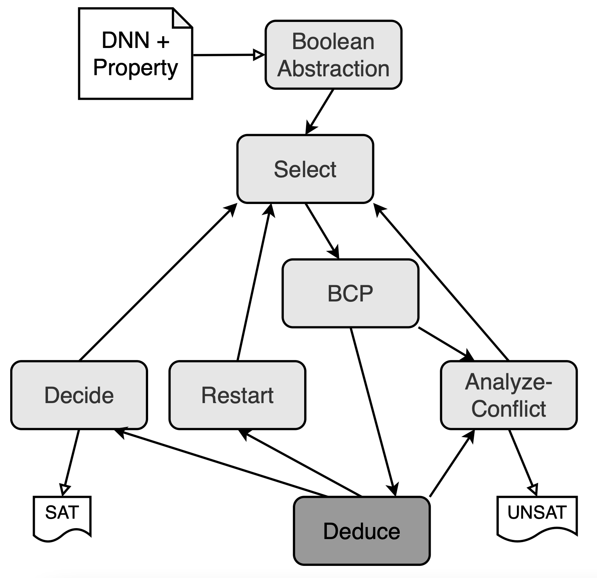
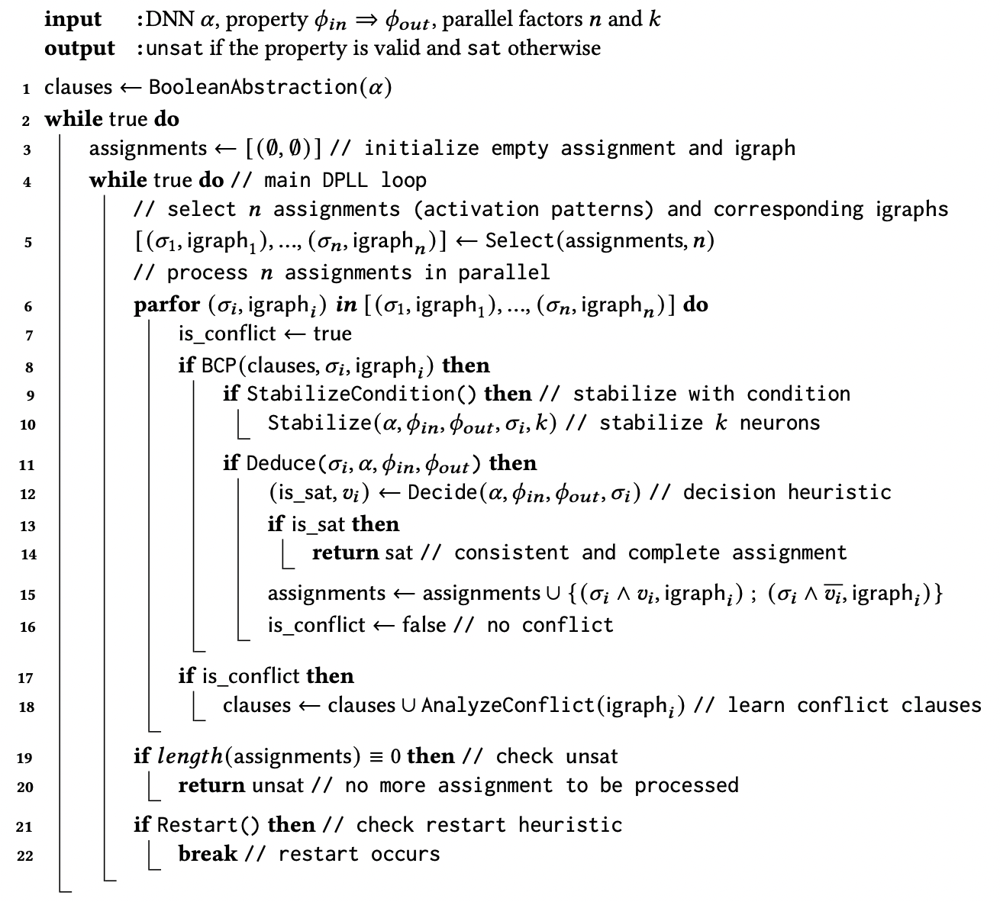
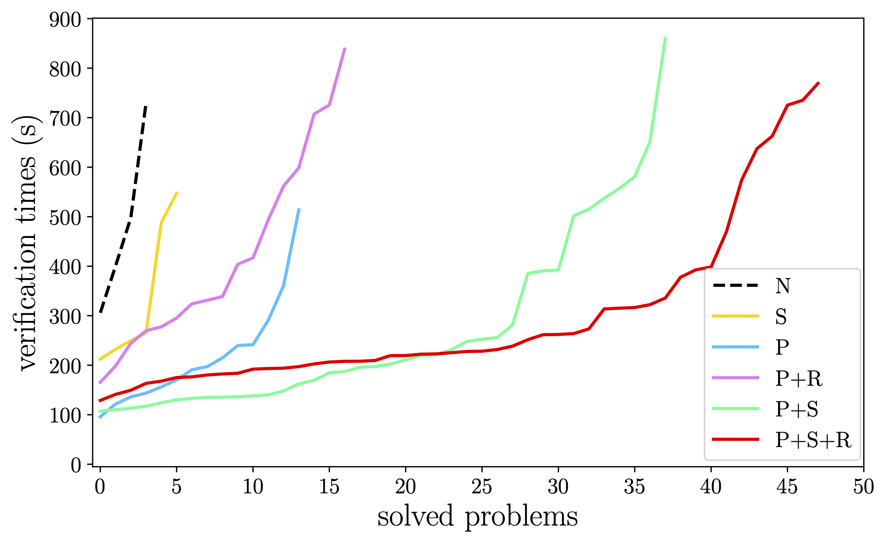
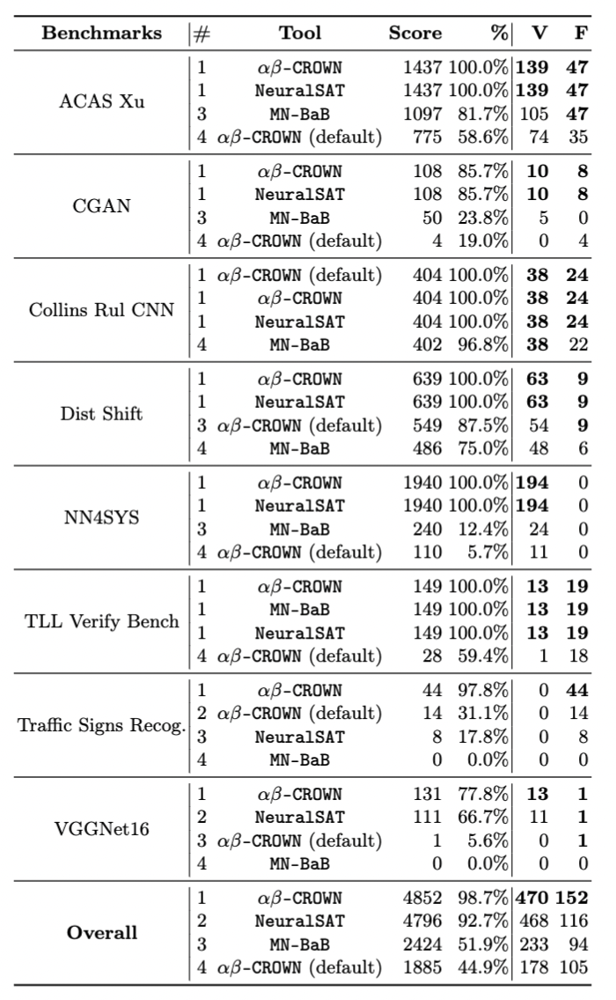

# NeuralSAT: A DPLL(T) Framework for Verifying Deep Neural Networks


*NeuralSAT* is a deep neural network (DNN) verification tool.  It integrates the DPLL(T) approach commonly used in SMT solving with a theory solver specialized for DNN reasoning. NeuralSAT exploits multicores and GPU for efficiency and can scale to networks with millions of parameters.  It also supports a wide range of neural networks and activation functions.


## NEWS
- NeuralSAT is ranked 4th in the recent VNN-COMP'23 (verify neural networks competition).  This was our first participation and we look forward to next time.

## INSTALLATION & USAGE
- see [INSTALL.md](./doc/INSTALL.md)

## FEATURES

- **standard** input and output formats
  - input: `onnx` for neural networks and `vnnlib` for specifications
  - output: `unsat` for proved property, `sat` for disproved property (accompanied with a counterexample), and `unknown` or `timeout` for property that cannot be proved.
  

- **versatile**: support multiple types of neural types of networks and activation functions
  - layers (can be mixture of different types): `fully connected` (fc), `convolutional` (cnn), `residual networks` (resnet), `batch normalization` (bn)
  - activation functions:  `ReLU`, `sigmoid`, `tanh`, `power`

- **well-tested**
  - NeuralSAT has been tested on a wide-range of benchmarks (e.g., ACAS XU, MNIST, CIFAR).
 
- **fast** and among the most scalable verification tools currently
  - NeuralSAT exploits and uses multhreads (i.e., multicore processing/CPUS) and GPUs available on your system to improve its performance.

- **active development** and **frequent updates**
  - If NeuralSAT does not support your problem, feel free to contact us (e.g., by [openning a new Github issue](https://arxiv.org/pdf/2307.10266.pdf)). We will do our best to help.
  - We will release new, stable versions about 3-4 times a year
  
- **fully automatic**, **ease of use** and requires very little configurations or expert knowledge
  - NeuralSAT requires *no* parameter tuning (a huge engineering effort that researchers often don't pay attention to)!  In fact, you can just apply NeuralSAT *as is* to check your networks and desired properties.  The user *does not* have to do any configuration or tweaking.  It just works!
    - But of course if you're an expert (or want to break the tool), you are welcome to tweak its internal settings.  
  - This is what makes NeuralSAT different from other DNN verifiers (e.g., AB-Crown), which require lots of tuning for the tools to work properly.

<details>

<summary><kbd>details</kbd></summary>

- **sound** and **complete** algorithm: will give both correct `unsat` and `sat` results
- combine ideas from conflict-clause learning (CDCL), abstractions (e.g., polytopes), LP solving
- employ multiple adversarial attack techniques for fast counterexamples (i.e., `sat`) discovery
</details>


## OVERVIEW

*NeuralSAT* takes as input the formula $\alpha$ representing the DNN `N` (with non-linear ReLU activation) and the formulae $\phi_{in}\Rightarrow \phi_{out}$ representing the property $\phi$ to be proved. 
Internally, it checks the satisfiability of the formula: $\alpha \land \phi_{in} \land \overline{\phi_{out}}$. 
*NeuralSAT* returns *`UNSAT`* if the formula is unsatisfiable, indicating  `N` satisfies $\phi$, and *`SAT`* if the formula is satisfiable, indicating the `N` does not satisfy $\phi$.

*NeuralSAT* uses a DPLL(T)-based algorithm to check unsatisfiability. 
It applies DPLL/CDCL to assign values to boolean variables and checks for conflicts the assignment has with the real-valued constraints of the DNN and the property of interest. 
If conflicts arise, *NeuralSAT* determines the assignment decisions causing the conflicts and learns clauses to avoid those decisions in the future. 
*NeuralSAT* repeats these decisions and checking steps until it finds a full assignment for all boolean variables, in which it returns *`SAT`*, or until it no longer can decide, in which it returns *`UNSAT`*. 

<p align="center">
  
</p>

## ALGORITHM

*NeuralSAT* constructs a propositional formula representing neuron activation status (`Boolean Abstraction`) and searches for satisfying truth assignments while employing a DNN-specific theory solver to check feasibility with respect to DNN constraints and properties. 
The process integrates standard DPLL components, which include deciding (`Decide`) variable assignments, and performing Boolean constraint propagation (`BCP`), with DNN-specific theory solving (`Deduce`), which uses LP solving and the polytope abstraction to check the satisfiability of assignments with the property of interest. 
If satisfiability is confirmed, it continues with new assignments; otherwise, it analyzes and learns conflict clauses (`Analyze Conflict`) to backtrack. 
*NeuralSAT* continues it search until it either proves the property (`UNSAT`) or finds a total assignment (`SAT`).

<p align="center">
  
</p>

### Boolean Representation
`Boolean Abstraction` encodes the DNN verification problem into a Boolean constraint to be solved. 
This step creates Boolean variables to represent the activation status of hidden neurons in the DNN. 
*NeuralSAT* also forms a set of initial clauses ensuring that each status variable is either `T` (active) or `F` (inactive).


### DPLL search
*NeuralSAT* iteratively searches for an assignment satisfying the clauses.
Throughout it maintains several state variables including: clauses, a set of clauses consisting of
the initial activation clauses and learned conflict clauses; $\alpha$, a truth assignment mapping status
variables to truth values which encodes a partial activation pattern; and $igraph$, an implication
graph used for analyzing conflicts.

### Decide 
`Decide` chooses an unassigned variable and assigns it a random truth value. 
Assignments from `Decide` are essentially guesses that can be wrong which degrades performance. 
The purpose of `BCP`, `Deduce`, and `Stabilize` – which are discussed below – is to eliminate unassigned
variables so that Decide has fewer choices.

### BooleanConstraintPropagation (BCP)
`BCP` detects unit clauses from constraints representing the current assignment and clauses and infers values for variables in these clauses.
For example, after the decision $a\mapsto F$, `BCP` determines that the clause $a \vee b$ becomes unit, and infers that $b \mapsto T$. 
Internally, *NeuralSAT* uses an implication graph to represent the current assignment and the reason for each BCP implication.

### AnalyzeConflict 
`AnalyzeConflict` processes an implication graph with a conflict to learn a new clause that explains the conflict. 
The algorithm traverses the implication graph backward, starting from the conflicting node, while constructing a new clause through a series of resolution steps. 
`AnalyzeConflict` aims to obtain an asserting clause, which is a clause that will result a BCP
implication. 
These are added to clauses so that they can block further searches from encountering an instance of the conflict.

### Theory Solver (T-solver)

`T-solver` consists of two parts: `Stabilize` and `Deduce`:

- `Deduce` checks the feasibility of the DNN constraints represented by the current propositional variable assignment. 
This component is shared with *NeuralSAT* and it leverages specific information from the DNN problem, including input and output properties, for efficient feasibility checking. 
Specifically, it obtains neuron bounds using the polytope abstraction and performs infeasibility checking to detect conflicts.

- `Stabilize` has a similar effect as `BCP` – reducing mistaken assignments by `Decide` – but it operates at the theory level not the propositional Boolean level. 
The key idea in using neuron stability is that if we can determine that a neuron is stable, we can assign the exact truth value for the corresponding Boolean variable instead of having to guess.
Stabilization involves the solution of a mixed integer linear program (MILP) system. 
First, a MILP problem is created from the current assignment, the DNN, and the property of interest.
Next, it collects a list of all unassigned variables which are candidates being stabilized.
In general, there are too many unassigned neurons, so `Stabilize` restricts consideration to `k` candidates.
Because each neuron has a different impact on abstraction precision we prioritize the candidates. 
In `Stabilize`, neurons are prioritized based on their interval boundaries with a preference for neurons with either lower or upper bounds that are closer to zero. 
The intuition is that neurons with bounds close to zero are more likely to become stable after tightening.

### Restart 

As with any stochastic algorithm, *NeuralSAT* would perform poorly if it gets into a subspace of the search that does not quickly lead to a solution, e.g., due to choosing a bad sequence of neurons to split.
This problem, which has been recognized in early SAT solving, motivates the introduction of restarting
the search to avoid being stuck in such a local optima.
*NeuralSAT*  uses a simple restart heuristic that triggers a restart when either the number of processed assignments (nodes) exceeds a pre-defined number or the number of remaining assignments that need be checked exceeds a pre-defined threshold.


## PERFORMANCES

To gain insights into the performance improvements of NeuralSAT we require benchmarks that force the algorithm to search a non-trivial portion of the space of activation patterns. 
It is well-known that SAT problems can be very easy to solve regardless of their size or whether they are satisfiable or unsatisfiable. 
The same is true for DNN verification problems.
The organizers of the first three DNN verifier competitions remark on the need for benchmarks that are "not so easy that every tool can solve all of them" in order to assess verifier performance.


To achieve this we leverage a systematic DNN verification problem generator [GDVB](https://github.com/edwardxu0/GDVB). 
GDVB takes a seed neural network as input and systematically varies a number of architectural parameters, e.g., number of layers, and neurons per layer, to produce a set of DNNs. 
In this experiment, we begin with a single MNIST network with `3` layers, each with `1024` neurons and generate `38` different DNNs that cover combinations of parameter variations. 
We leverage the fact that local robustness properties are a pseudo-canonical form for pre-post condition specifications and use GDVB to generate 16 properties with varying radii and center points. 
Next we run two state-of-the-art verifiers: $\alpha\beta$-CROWN and MN-BaB, for each of the `38 * 16 = 608` combinations of DNN and property with a small timeout of `200` seconds. 
Any problem that could be solved within that timeout was removed from the benchmark as "too easy". 
This resulted in `90` verification problems that not only are more computationally challenging than benchmarks used in other studies, but also exhibit significant architectural diversity. 
We use this [MNIST_GDVB](https://github.com/dynaroars/neuralbench/tree/main/instances/mnist_gdvb) benchmark to study the variation in performance on challenging problems.

### MNIST_GDVB benchmark

<p align="center">
  
</p>

Here we focus primarily on the benefits and interactions among the optimizations in NeuralSAT compared to the baseline `N` which is NeuralSAT without any optimization.
The plot shows the problems solved within the 900-second timeout for each technique sorted by runtime from fastest to slowest; 
problems that timeout are not shown on the plot. 

We omit the use of restart `R` on its own, since it is intended to function in concert with parallelization.
Both stabilization `S` and parallelization `P` improve the number of problems solved and reduce cost relative to the baseline, but parallelism `P` yields greater improvements. 
When parallelism `P` is combined with restart `R` we see that the number of problems solved increases, but the average time increases slightly. 
The plot shows the trend in verification solve times for each optimization combination across the benchmarks. 
One can observe that adding more optimizations improves performance both by the fact that the plots are lower and extend further to the right. 
For example, extending `P` to `P+S` shows lower solve times for the first `17` problems – the one's `P` could solve – and that `38` of the `51` benchmark problems are solved. 
Extending `P+S` to the full set of optimizations exhibits what appears to be a degradation in performance for the first `23` problems solved and this is likely due to the fact that, as explained above, restart forces some re-exploration of the search. 
However, the benefit of restart shows in the ability to significantly reduce verification time for `25` of the `48` problems solved by `P+S+R`.

### VNN-COMP's benchmarks

<p align="center">
  
</p>


## PEOPLE

- Hai Duong (GMU, main developer)
- Linhan Li (GMU)
- Dong Xu (UVA)
- [ThanhVu Nguyen](https://dynaroars.github.io/people/nguyenthanhvuh/) (GMU)
- [Matthew Dwyer](https://matthewbdwyer.github.io/) (UVA)


## :page_with_curl: PUBLICATIONS
- Hai Duong, ThanhVu Nguyen, Matthew Dwyer. [**A DPLL(T) Framework for Verifying Deep Neural Networks**](https://arxiv.org/pdf/2307.10266.pdf), Arxiv, 2024.

```
@misc{duong2024dpllt,
      title={A DPLL(T) Framework for Verifying Deep Neural Networks}, 
      author={Hai Duong and ThanhVu Nguyen and Matthew Dwyer},
      year={2024},
      eprint={2307.10266},
      archivePrefix={arXiv},
      primaryClass={cs.LG}
}
```

- Hai Duong, Dong Xu, ThanhVu Nguyen, Matthew Dwyer. [**Harnessing Neuron Stability to Improve DNN Verification**](https://arxiv.org/pdf/2401.14412.pdf), Foundations of Software Engineering (FSE), 18 pages (to appear), 2024.
```
@misc{duong2024harnessing,
      title={Harnessing Neuron Stability to Improve DNN Verification}, 
      author={Hai Duong and Dong Xu and ThanhVu Nguyen and Matthew B. Dwyer},
      year={2024},
      eprint={2401.14412},
      archivePrefix={arXiv},
      primaryClass={cs.LG}
}
```

## ACKNOWLEDGEMENTS
The *NeuralSAT* research is partially supported by grants from NSF ([2238133](https://www.nsf.gov/awardsearch/showAward?AWD_ID=2238133)) and an Amazon Research Award.

