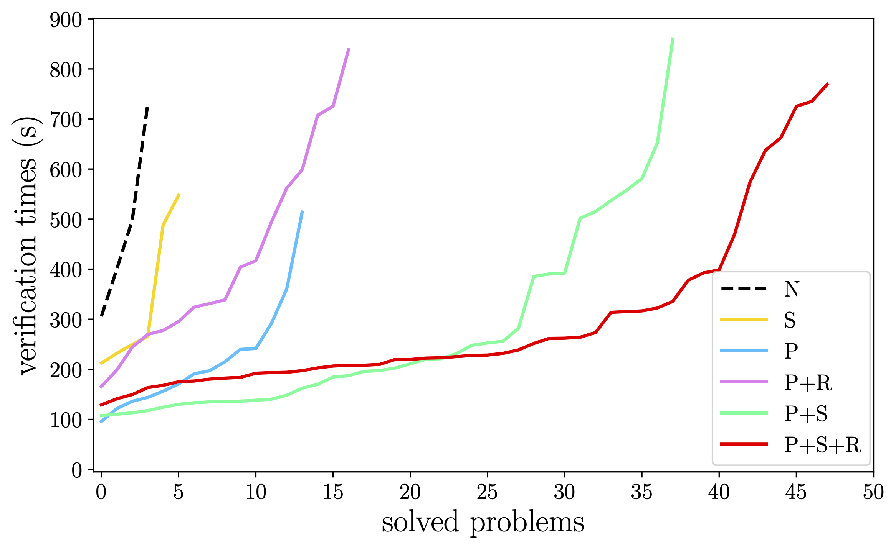
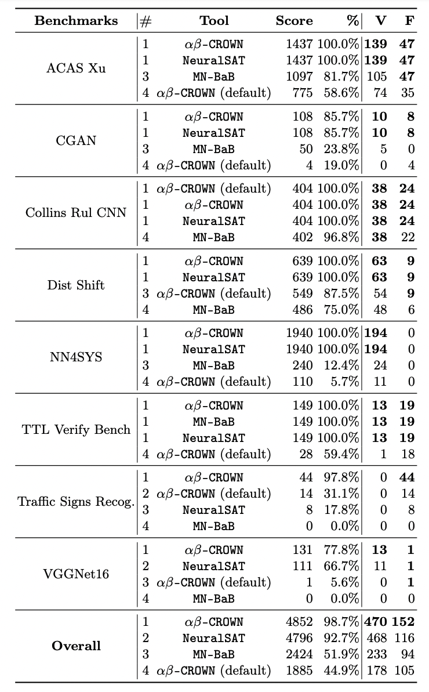

# NeuralSAT Performances
To gain insights into the performance improvements of NeuralSAT we require benchmarks that force the algorithm to search a non-trivial portion of the space of activation patterns. 
It is well-known that SAT problems can be very easy to solve regardless of their size or whether they are satisfiable or unsatisfiable. 
The same is true for DNN verification problems.
The organizers of the first three DNN verifier competitions remark on the need for benchmarks that are "not so easy that every tool can solve all of them" in order to assess verifier performance.

To achieve this we leverage a systematic DNN verification problem generator [GDVB](https://github.com/edwardxu0/GDVB). 
GDVB takes a seed neural network as input and systematically varies a number of architectural parameters, e.g., number of layers, and neurons per layer, to produce a set of DNNs. 
In this experiment, we begin with a single MNIST network with `3` layers, each with `1024` neurons and generate `38` different DNNs that cover combinations of parameter variations. 
We leverage the fact that local robustness properties are a pseudo-canonical form for pre-post condition specifications and use GDVB to generate 16 properties with varying radii and center points. 
Next we run two state-of-the-art verifiers: $\alpha\beta$-CROWN and MN-BaB, for each of the `38 * 16 = 608` combinations of DNN and property with a small timeout of `200` seconds. 
Any problem that could be solved within that timeout was removed from the benchmark as "too easy". 
This resulted in `90` verification problems that not only are more computationally challenging than benchmarks used in other studies, but also exhibit significant architectural diversity. 
We use this [MNIST_GDVB](#1-mnist_gdvb-benchmark) benchmark to study the variation in performance on challenging problems.

## 1. MNIST_GDVB benchmark

  

Here we focus primarily on the benefits and interactions among the optimizations in NeuralSAT compared to the baseline `N` which is NeuralSAT without any optimization.
The plot shows the problems solved within the 900-second timeout for each technique sorted by runtime from fastest to slowest; 
problems that timeout are not shown on the plot. 

We omit the use of restart `R` on its own, since it is intended to function in concert with parallelization.
Both stabilization `S` and parallelization `P` improve the number of problems solved and reduce cost relative to the baseline, but parallelism `P` yields greater improvements. 
When parallelism `P` is combined with restart `R` we see that the number of problems solved increases, but the average time increases slightly. 
The plot shows the trend in verification solve times for each optimization combination across the benchmarks. 
One can observe that adding more optimizations improves performance both by the fact that the plots are lower and extend further to the right. 
For example, extending `P` to `P+S` shows lower solve times for the first `17` problems – the one's `P` could solve – and that `38` of the `51` benchmark problems are solved. 
Extending `P+S` to the full set of optimizations exhibits what appears to be a degradation in performance for the first `23` problems solved and this is likely due to the fact that, as explained above, restart forces some re-exploration of the search. 
However, the benefit of restart shows in the ability to significantly reduce verification time for `25` of the `48` problems solved by `P+S+R`.

## 2. VNN-COMP's benchmarks

  

